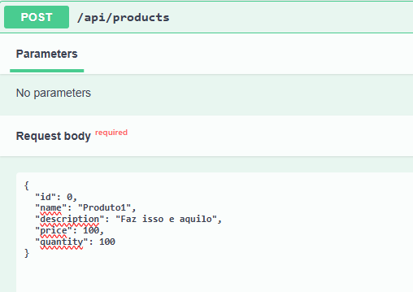
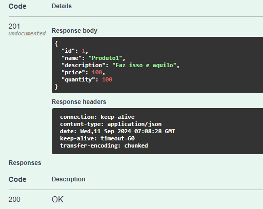
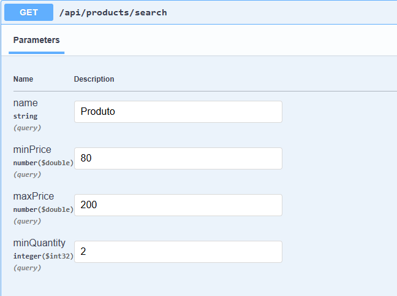
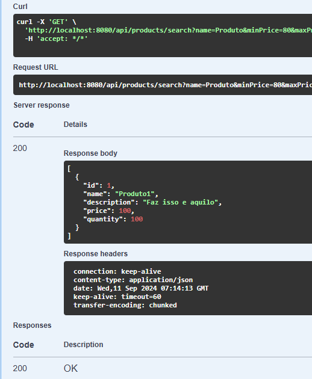
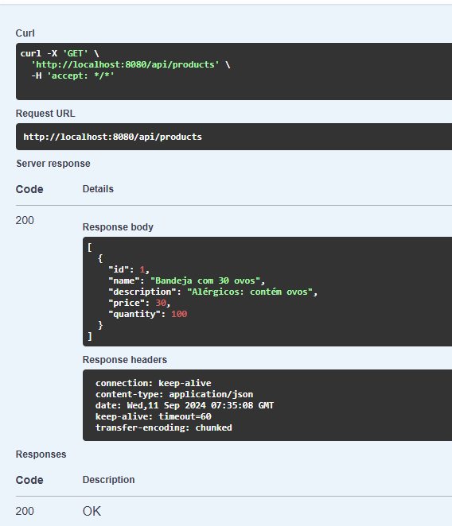
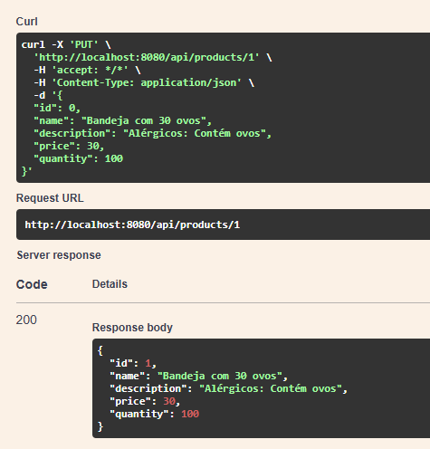
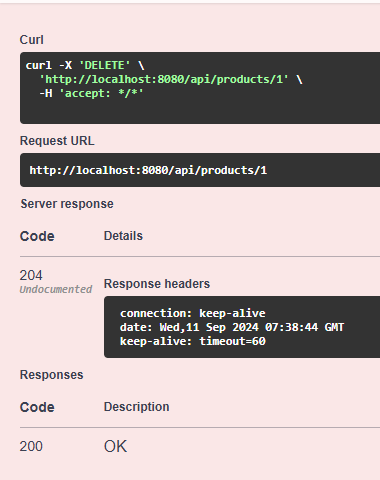

## Laboratório 2 de DS3

Desenvolvimento de uma API REST para Gestão de Estoque de Produtos utilizando Spring Boot e Java

### Resolução

**CREATE(POST)**

**GET(WITH FILTERS)**

**GET(ALL)**

**PUT(UPDATE BY ID)**

**DELETE(BY ID)**

